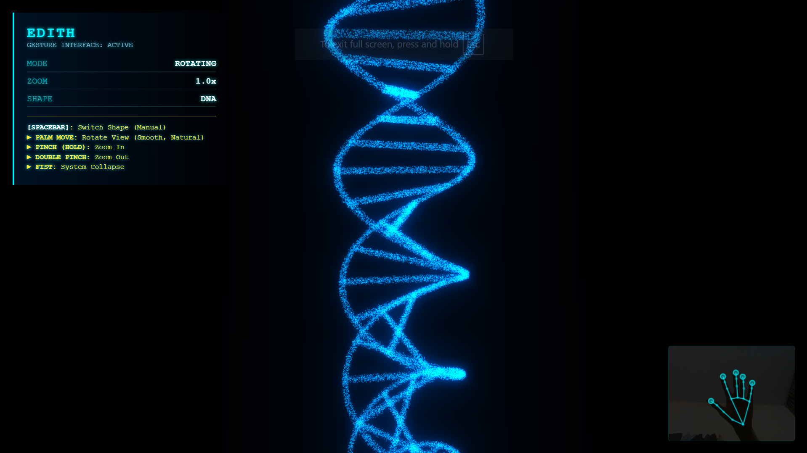

# EDITH 🕶️

> **Even Dead I'm The Hero** — A next-generation, high-performance gesture-controlled interactive 3D particle system inspired by Tony Stark's EDITH system.



EDITH is an immersive, web-based 3D particle simulation that leverages **Three.js** for rendering and **Google MediaPipe Tasks Vision** for real-time hand and face tracking. Interact with 100,000 glowing particles dynamically floating in space using natural hand movements, gestures, and facial structures detected via your webcam.

---

## 🚀 Features

- **Interactive 100,000 Particle Simulation**: High-performance particle physics powered by custom WebGL shaders.
- **AI-Powered Gesture Interface**: Fully hands-free operation using advanced computer vision (MediaPipe):
  - **Palm Movement**: Rotate the 3D space smoothly and naturally.
  - **Single Pinch & Hold**: Zoom closer into the core.
  - **Double Pinch & Hold**: Zoom away from the core.
  - **Fist**: Trigger an instant system collapse (implosion of all particles).
- **Face Mesh Construction**: Tracks facial contours using your webcam to reconstruct your face shape with particles in real-time.
- **Tony Stark Inspired HUD**: A sleek holographic blue heads-up display overlay showing status, zoom levels, active shapes, and calibration feedback.
- **Dynamic 3D Geometry**: Supports multiple morphing shape states:
  - `ATOM`, `DNA`, `SPHERE`, `GALAXY`, `CUBE`, `HEART`, `SATURN`, and `FACE`.
- **Cinematic Visuals**: Post-processing Unreal Bloom rendering for realistic neon glows and cosmic dust effects.

---

## 🎮 How to Control

### 🖐️ Gesture Controls (Webcam Required)
| Action | Gesture |
| :--- | :--- |
| **Rotate View** | Move your open palm left/right/up/down in front of the camera. |
| **Zoom In** | Pinch index finger and thumb together and hold. |
| **Zoom Out** | Pinch, release quickly, then pinch again and hold (Double Pinch). |
| **System Collapse** | Make a tight fist to pull all particles into a singularity. |

### ⌨️ Keyboard Controls (Manual Override)
- **`[SPACEBAR]`**: Switch to the next shape state (Atom ➔ DNA ➔ Sphere ➔ Galaxy ➔ Cube ➔ Heart ➔ Saturn ➔ Face).

---

## 🛠️ Technology Stack

- **Graphics & Rendering**: [Three.js](https://threejs.org/) (WebGL)
- **Computer Vision**: [Google MediaPipe Tasks Vision](https://developers.google.com/mediapipe/solutions/vision/hand_landmarker) (v0.10.0 HandLandmarker & FaceLandmarker)
- **Styling & HUD**: Vanilla CSS with glassmorphism and modern futuristic typography.

---

## 📦 Getting Started

To run EDITH locally:

1. Clone this repository:
   ```bash
   git clone https://github.com/hazynyx/Edith-3d.git
   cd Edith-3d
   ```
2. Open `particles.html` in any modern web browser. 
3. *Note*: Since MediaPipe utilizes webcam feeds, some browsers require pages requesting webcam access to be served via `localhost` (e.g., using a local server extension like Live Server, Python's `http.server`, or Node's `http-server`).
   ```bash
   # Quick launch via python
   python -m http.server 8000
   ```
   Then navigate to `http://localhost:8000/particles.html`.
4. Grant webcam access permissions when prompted by your browser to initialize hand and face tracking.

---

## 📄 License

This project is licensed under the MIT License. See the [LICENSE](LICENSE) file for details.

Developed with ❤️ by [Hazynyx](https://github.com/hazynyx).
